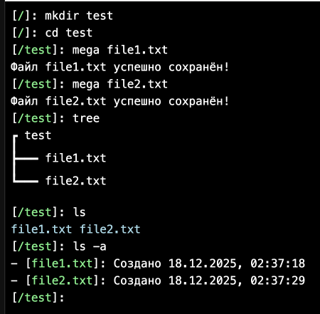
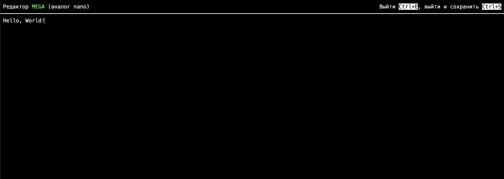

# Лабораторная работа №1

Автор - Круглов Леонид

## Главная сущность - File

Содержит в себе информацию об объекте:

* Имя объекта
* Путь (путь к родительской папке)
* Тип объекта (является ли он папкой)
* Метаданные (дата создания)
* Ссылка на реальный файл (если этот объект - файл)

Таким образом, данная сущность объединяет в себе сразу обе сущности - и Папку, и Файл, поскольку отличие состоит лишь в наличии ссылки на реальный файл

## Взаимодействие

Для тестов реализован фронтенд в виде командной строки с набором команд:

### Создать папку

```bash
mkdir [имя папки]
```

Отправляет на сервер запрос `POST` `/dir/create?name=[Имя папки]&path=[Путь к папке]`

### Перейти в папку (или выйти из неё)

```bash
cd [путь перехода]
```

Поддерживается переход в предыдущий католог (../), в этот (./) и корневой (/)

Отправляет на сервер запрос `GET` `/dir/exist?path=[Путь к папке]` для проверки наличия такой папки

### Просмотреть содержимое папки (поиск)

```bash
ls
ls -a
```

При наличии флага `-a` выводит в том числе и метаданные (дату создания)

Отправляет на сервер запрос `GET` `/dir/ls?path=[Путь к папке]`

### Вывести дерево содержимого папки (поиск)

```bash
tree
```

Выводит дерево всех файлов и подкатологов данного католога

Отправляет на сервер запрос `GET` `/dir/tree?path=[Путь к папке]`

### Создание файла (изменение существующего)

```bash
mega [название нового файла]
```

Открывается окно для ввода тестового файла. Для выхода и сохранения файла необходимо нажать `Ctrl+C`. Если не требуется сохранить файл, необзодимо нажать `Ctrl+E`.

Отправляет на сервер запрос `GET` `/file/read?path=[Путь к папке]` для чтения файла. Если файл не существует, то он будет создан при выходе из окна. Если существует, то при выходе из окна он будет перезаписан.

Для записи файла отправляет на сервер запрос `POST` `/file/create` с телом:
```json
{
    "name": Имя файла,
    "path": Путь к родительской папке,
    "value": Значение файла
}
```

Для обновления файла отправляет на сервер запрос `POST` `/file/update` с телом:
```json
{
    "path": Путь к файлу,
    "value": Значение файла
}
```

## Запуск

### Фронтенд

> Очень прошу взлянуть хотя бы одним глазком - в течении месяца его кусочно делал :-)

Для запуска фронтенда необходимо прописать команду:
```bash
docker compose up -d
```

Для раздачи статики фронтенда используется Web-сервер NGINX (конфигурация находится в файле nginx.conf). Для избежания CORS при отправке запросов на сервер, внутри него работает обратный прокси с пути `/api` на хост бэкенда:

* http://localhost:7777 -> статика фронтенда
* http://localhost:7777/api/[запрос] -> http://localhost:8080/api/[запрос]

Фронтенд будет запущен на localhost:7777

### Бэкенд

Для запуска бэкенда необходимо прописать команду:
```bash
./mvnw spring-boot:run
```

Бэкенд будет доступен на localhost:8080

В качестве БД используется PostgreSQL. В файле `/src/main/resources/application.properties` указаны параметры БД:
* порт (5432)
* логин пользователя (postgres)
* пароль пользователя (postgres)
* название базы данных (laba1)

## Тестирование

На рисунке 1 показаны тест основных функций (ls, mkdir, cd, tree и mega):



На рисунке 2 показан внешний вид MEGA:

